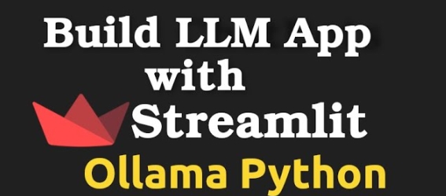
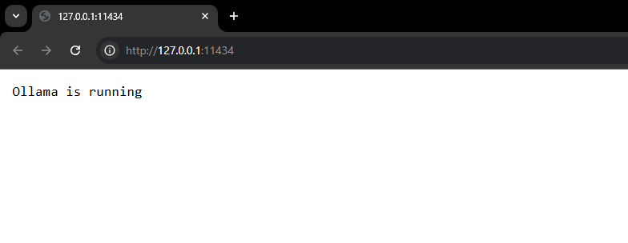
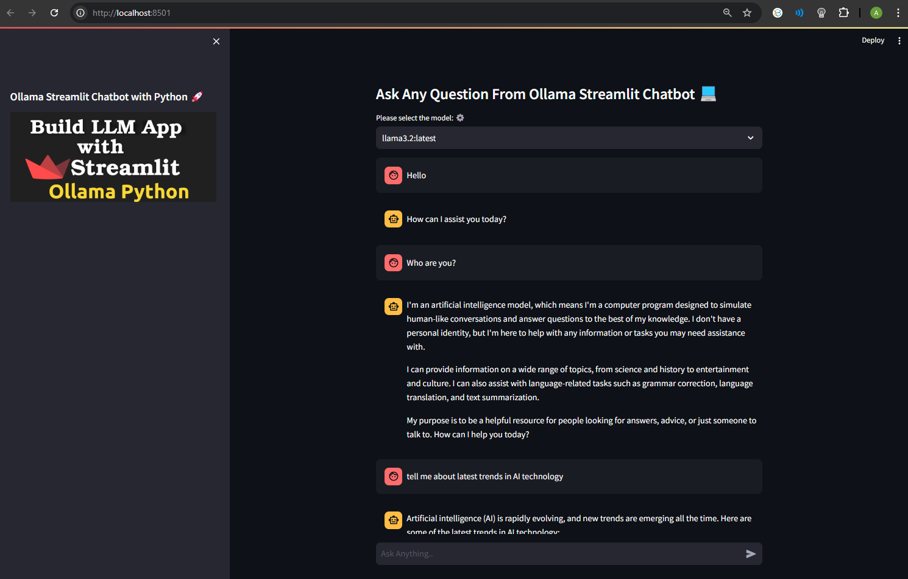

# Ollama Chatbot with Streamlit


### Install and execute Ollama (for windows)
- Download Ollama for windows. (https://ollama.com/download/windows)
- Execute ollama and run llama3.2 model
```bash
ollama run llama3.2
```


- Verify Ollama

You can open the browser and enter http://127.0.0.1:11434 to confirm whether the ollama server is running.

### Usage
#### Create virtual environment and install required packages:
```bash
conda create -n ollama_env python==3.10.9
conda activate ollama_env
pip install streamlit ollama -i https://pypi.tuna.tsinghua.edu.cn/simple --default-timeout=1000
```
- Clone Repository
```bash
git clone https://github.com/Zeeshann1/Ollama-Chatbot-Streamlit.git
cd Ollama-Chatbot-Streamlit
```
- Install Requirements
```bash
pip install -r requirements.txt
```
Note that ollama server is running

- Run main.py
```bash
streamlit run main.py
```
### Results



- If you get any error
```bash
pip install numpy==1.26.4 pyyaml
pip install --upgrade numpy
pip uninstall numpy
pip install numpy
pip install --upgrade pandas pandasai
```

### References:
- https://ollama.com/library
- https://github.com/ollama/ollama-python
- https://github.com/ollama/ollama?tab=readme-ov-file

